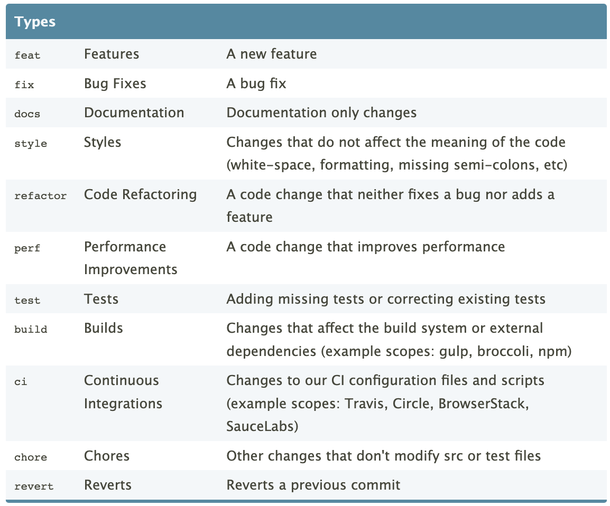

# Git Best Practices

---

## Writing good commit messages

- A commit message should explain what the commit does, in a clear and concise way.
- It should be written in the imperative tense.
- It should be less than 50 characters in the summary line and less than 72 characters in the optional body.
- Follow the [Conventional Commits Guidelines](https://www.conventionalcommits.org/en/v1.0.0/)
  - See the [Conventional Commits VS Code extension](https://marketplace.visualstudio.com/items?itemName=vivaxy.vscode-conventional-commits) which can help make authoring commit messages in a standard way much simpler.

---

## Conventional Commits

---

## Keeping a clean repository

- Avoid committing files that are not needed for the project, such as compiled files or temporary files. This means no data or models - keep them in a separate storage account (e.g. S3 bucket).
- Use `.gitignore` file to ignore folders and files that are not needed.
- Keep commits small and focused on a specific change.

---

## Using .gitignore

- A .gitignore file is a text file that tells Git which files or directories to ignore.
- You can create a `.gitignore` file in the root of your repository and add the files or directories you want to ignore.

---

## Tips for debugging and troubleshooting

- Use `git log` to see the history of the commits.
- Use `git diff` to see the changes made to a file.
- Use `git stash` to save changes that you are currently working on.

---

## Best practices for working with multiple people on a project

- Communicate with your team members and agree on a branching strategy and naming conventions.
- Use pull requests to review and merge changes.
- Review and test each other's code before merging - this means checking out their branch and executing the code. Does it work the way you expect? Only put things in your main branch that have passed your team's quality checks.

---

## Branching strategies

- A pattern that works well for small teams is the "GitHub Flow".
- Developers create branches off of `main` called feature branches.
- Changes are always merged back into `main` (your single source of truth).
- The feature branch is always deleted after merging!
- Keep the purpose of the branch simple and clear to make the review process easier.
- It's better to do many smaller pull requests than 1 large one.

---

## GitHub Flow

---

## Exercise I [10 minutes]

- Working in your own repo again, create a branch off of `main` called `create-gitignore` and check it out.
- Create a text file in the root of your repo called `data.txt` and put a few lines of dummy data in it.
- Create a `.gitignore` file in the root of your repo with the following contents: `data.txt`
- Try to stage and commit. For the commit, take a look at `Conventional Commits` and prepend your commit message with the correct tag, e.g. `tag: my commit message`

---

## Exercise II [10 minutes]

- As in the earlier exercise, publish your branch and open a pull request.
- Ask your partner to review and approve the pull request.
- Merge your changes in and delete the `create-gitignore` branch in GitHub and locally.

---

## Exercise II [15 minutes]

- Discuss as a group which file(s) were included in this pull request and why a `.gitignore` file would be useful when working on a project with large amounts of data.
- Discuss as a group why only having working, reviewed changes in `main` will be beneficial for a project.
